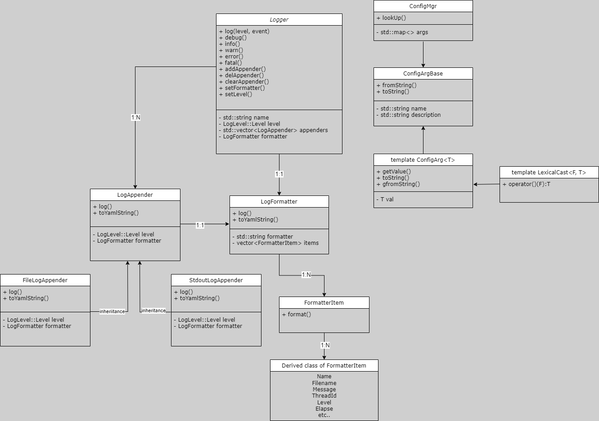

# Server Framework

## Development Environment

    Ubuntu 11.4.0
    Clang 14.0.0
    Cmake 3.22.1

## External Dependency

[Boost](https://www.boost.org/) : Boost is a widely-used collection of open-source, peer-reviewed libraries that extend the functionality of the C++ programming language. \
[Catch2](https://github.com/catchorg/Catch2) : 
Catch2 is a modern, C++-native, header-only testing framework for unit tests, TDD (Test Driven Development), and BDD (Behavior Driven Development). \
[yaml-cpp](https://github.com/jbeder/yaml-cpp) : yaml-cpp is a C++ library for parsing and emitting YAML (YAML Ain't Markup Language) data. 


## Project Structure
    .
    |—— bin             // binaries
    |—— build           // intermediate files
    |—— cmake           // cmake function folder
    |—— lib             // library output folder
    |—— tests           // testing code
    |—— source          // source code
    |—— CMakeLists.txt
    |—— Makefile

## Modules
### Logger Module

[**Log4j**](https:github.com/apache/logging-log4j2) is a java-based logging framework, we will refer to its implementation to create a similar framework.


    Logger (Define Logger class)
        |
        |  
        |  
    Appender (Logger output) ----- Formatter (format Log)
        |
        |----------
        |         |
    Console     Files

When we try to log info, we would pass an event into Logger, the Logger would use Appender to output event to console or files;

The appender contains a formatter, which contains a set of formatter items, these items could be config by our pre-defined pattern (support default pattern if we don't set a specific pattern)


__Module Features__:

1. Output logs in streaming log style 
```cpp
    Server::Logger::ptr logger(new Server::Logger); 
    SERVER_LOG_INFO(logger) << "Event occur"; // store any messages into stream
```
    
2. Support customized log formats

The logging format we use (refer to [Log4j TTCC](https://en.wikipedia.org/wiki/Log4j#cite_note-28))

    %m --- message body
    %p --- priority level
    %r --- number of milliseconds elapsed since the logger created
    %c --- name of logger
    %t --- thread id
    %n --- newline char
    %d --- time stamp
    %f --- file name
    %l --- line number
    %T --- Tab
    %F --- Coroutine Id

3. multi-log separation: enable logging same info with different output destination 

3. free configuration of log such as time, thread ID, thread name, log level, log name, file name, line number.
 
----- 
#### Logging Level
Logging level indicate serverity or importance of the messages logged by the application. We defined 5 level in our module.

**DEBUG**:  Detailed information, typically of interest only when diagnosing problems.

**INFO**:  Informational messages that highlight the progress of the application at a coarse-grained level.

**WARN**:  Potentially harmful situations that indicate some kind of issue or minor problem.

**ERROR**:  Error events that might still allow the application to continue running.

**FATAL**:  Very severe error events that will presumably lead the application to abort.

-----
### Configuration Module

Configuration Module is used to store all system configuration (e.g logger)


We use ["Convention over Configuration"](https://facilethings.com/blog/en/convention-over-configuration) principle to design the module, and avoid unnecessary pre-configuration.

__Module Features__:

1. Used yaml-cpp as parsing tool to load yaml file

2. Support yaml serialization and deserialization

```cpp
YAML::NODE node = YAML::LoadFile(filename)

for (auto it = node.begin(); it != node.end(); ++it) {
    it->first, it->second
}

for (size_t i = 0; i < node.size(); ++i) {

}

```
3. Used partial specialized template to support conversion between stl container(map/unordered_map, set/unordered_set, vector, list) and Yaml

4. Support nontification event when configuration is changed : Once configuration in yaml file is changed, we can detect and update during run time via callback ([Observer pattern](https://refactoring.guru/design-patterns/observer)).

5. Intergrate logger module with configuration module, to support user customized configuration before lanuching the application

```yaml
logs:
    - name: root
      level: (debug, info,warn,error,fatal)
      formatter: '%d%T%p%T%t%m%n'
      appender:
        - type: (StdoutLogAppender, FileLogAppender)
          level: (debug,info,warn,error,fatal)
          file: /logs/xxx.log
```
```cpp
Server::Logger::ptr g_logger = Server::LoggerMgr::getInstance()->getLogger(name); //Server::Logger::ptr g_logger = SERVER_LOG_NAME(name)
SERVER_LOG_INFO(g_logger) << "xxxx log";
```

```cpp
static Logger::ptr g_log = SERVER_LOG_NAME("system");
// when appenders of logger is empty, use root(default) for output
```

__Note__: At this point, the key of map only support std::string type

### Thread Module
Encapsulate common functionalities of C++ 11 thread library, using \<pthread\.h> library.

Implement customized thread/semaphore/mutex/RWMutex/CASlock/Spinlock which supports standard interface. 

RWMutex/CASlock/Spinlock are commonly used in high concurrency situation.

```cpp
    Server::Mutex mutex;
    for (int i = 0; i < 10000; ++i) {
        Server::Mutex::Lock lock(mutex);
        ++count;
    }
```

### Coroutine Module
Coroutine: Light-weight thread compared with thread (i.e. a thread of a thread). Currently implemented by uconttext_t, would be upgraded by boost.context in the future.

```
    Thread -> main_fiber <------> sub_fiber
                ^
                |
                v
            sub_fiber
```

### Coroutine Scheduler Module
```
          1:N         1:M
scheduler ---> thread ---> fiber

1. Utilize thread pool for thread management in coroutine scheduler
2. Coroutine scheduler, assign coroutine to specific thread and execute

```


### IO Coroutine Schedule Module

## Testing

We would use Catch2 for unit testing, and a high-resolution timer for performance testing

## Model 


